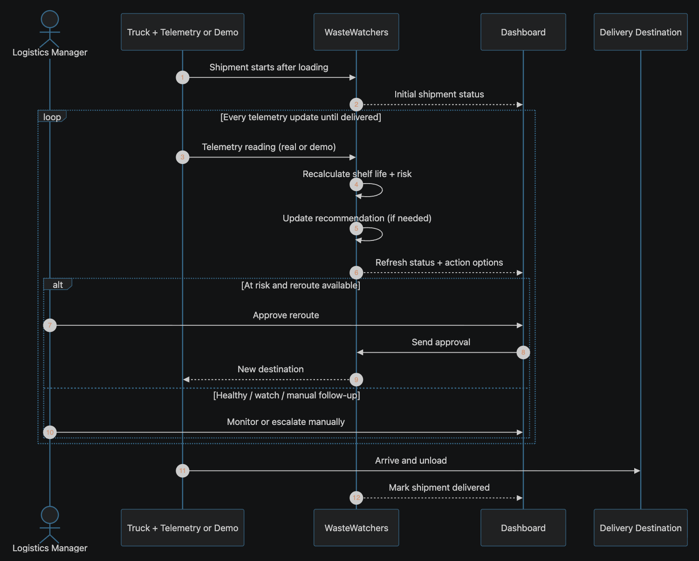

**Notice:** This repository represents our 3 day hackathon prototype. Active commercial development, proprietary predictive models, and core backend logic have been transitioned to a private repository.

# 🌱 WasteWatchers

**Real-time cold-chain monitoring and salvage rerouting for agricultural logistics**

## The Problem

Agricultural shipments depend on constant refrigeration during transit. Managers usually do have visibility into cooling risk, but turning that signal into a viable salvage decision still takes about an hour. That delay forces time-sensitive manual coordination while shelf life keeps dropping, increasing spoilage risk and product loss.

## The Solution

WasteWatchers is an API middleware that automates cold-chain risk detection and salvage resolution. It bridges the gap between fleet telemetry and warehouse operations by:

- **Ingesting live trailer temperature data** from in-transit shipments
- **Cross-referencing commodity thermal profiles** to detect cooling failures
- **Calculating remaining crop shelf life** in real time
- **Generating automated salvage rerouting recommendations** for farm logistics managers
- **Enabling one-click approval** of reroute decisions before spoilage becomes unrecoverable

## How It Works

### The Workflow

1. **Real-Time Telemetry Ingestion**: Live trailer temperature readings are ingested for active shipments
2. **Thermal Profile Matching**: Each shipment is matched to its commodity's thermal profile (acceptable temperature range and shelf-life sensitivity)
3. **Shelf-Life Calculation**: Remaining crop shelf life is calculated after each telemetry update based on the commodity profile and temperature history
4. **Risk Classification**: Shipments are classified into operational states: healthy, watch, at-risk, salvage recommended, reroute approved, or manual follow-up required
5. **Dashboard Visualization**: Farm logistics managers see all at-risk shipments with affected commodity, current status, remaining shelf life, and recommended actions
6. **One-Click Approval**: Managers can approve salvage reroutes with a single deliberate action
7. **Audit Trail**: Every approval is recorded with shipment identity, decision maker, decision time, and resulting state

### Key Features

- ✅ **Early Detection**: Identify at-risk shipments 2+ hours before dock arrival
- ✅ **Risk-Based Prioritization**: Dashboard ranks shipments by urgency and remaining shelf life
- ✅ **Automated Recommendations**: Smart salvage rerouting options based on commodity and logistics constraints
- ✅ **Fast Decision Making**: Managers can review and approve reroutes in under 60 seconds
- ✅ **Complete Audit Trail**: Full decision records for compliance and post-incident analysis
- ✅ **Error Handling**: Telemetry gaps, missing profiles, and calculation errors route to manual follow-up instead of silently failing
- ✅ **Live Operations Dashboard**: Real-time visualization of all shipments, pallet positions, and trailer conditions

## Screenshots & Demo

### Operations Dashboard

The live operations dashboard displays all active shipments with detailed pallet visualizations, real-time temperature monitoring, and status indicators.

- **Empty State**: Helpful guidance when no shipments are loaded
- **Demo Scenario**: Load fictional shipments to see the system in action
- **Pallet Visualization**: View assigned pallet positions on reefer trailers
- **Status Indicators**: Visual indicators for healthy, watch, at-risk, and critical shipments

### To Run the Demo

```bash
# Terminal 1: Start the backend
uvicorn backend.src.main:app --reload

# Terminal 2: Start the Streamlit dashboard
streamlit run frontend/app.py
```

Then open the dashboard and select "Load Demo Scenario" to see sample shipments with different risk levels.

## Getting Started

### Prerequisites

- Node.js 18+ (for Next.js frontend)
- Python 3.9+ (for backend and Streamlit dashboard)

### Installation

1. **Clone the repository**

   ```bash
   git clone https://github.com/AbeGue02/wastewatcher.git
   cd wastewatcher
   ```

2. **Install frontend dependencies**

   ```bash
   npm install
   ```

3. **Install backend dependencies**
   ```bash
   pip install -r requirements.txt
   ```

### Development

#### Frontend (Next.js)

```bash
npm run dev
```

Open [http://localhost:3000](http://localhost:3000) in your browser.
By default, Next.js rewrites API requests to [https://wastewatcher.onrender.com](https://wastewatcher.onrender.com). Set `WASTEWATCHERS_API_ORIGIN` in `.env.local` to override (for example, `http://127.0.0.1:8000` when running FastAPI locally).

#### Backend (FastAPI)

```bash
uvicorn backend.src.main:app --reload
```

The API is available at [http://localhost:8000](http://localhost:8000)

#### Dashboard (Streamlit)

```bash
streamlit run frontend/app.py
```

The dashboard opens at [http://localhost:8501](http://localhost:8501)

### Building for Production

```bash
npm run build
npm start
```

## Project Structure

```
wastewatcher/
├── backend/                    # FastAPI backend for telemetry and calculations
│   └── src/
│       ├── main.py            # API entry point
│       └── ...                # Business logic modules
├── frontend/                  # Streamlit dashboard
│   └── app.py                # Dashboard entry point
├── src/                       # Next.js app source
│   └── app/                  # App Router pages and components
├── public/                    # Static assets
├── docs/                      # Documentation
├── specs/                     # Feature specifications
├── package.json              # Frontend dependencies
├── pyproject.toml            # Backend dependencies
└── README.md                 # This file
```

## Key Data Models

- **Shipment**: A crop load in transit with identity, trailer, commodity, and transit state
- **Trailer Telemetry Reading**: Time-stamped temperature observations tied to shipments
- **Commodity Thermal Profile**: Acceptable temperature ranges and shelf-life sensitivity rules
- **Shelf-Life Assessment**: Calculated remaining shelf life and risk status for each shipment
- **Reroute Recommendation**: Proposed salvage actions with destination and urgency
- **Approval Record**: Manager decisions with auditable timestamp and reasoning

## Sequence Diagram



## System Design Requirements

- The system must ingest live trailer telemetry for active shipments, including shipment ID, trailer ID, temperature, and timestamp.
- The system must validate and map each shipment to a commodity thermal profile before risk decisions are made.
- The system must calculate and refresh remaining shelf-life assessments as new telemetry arrives.
- The system must classify shipments into operational risk states (healthy, watch, at-risk, salvage recommended, reroute approved, manual follow-up).
- The system must present validated risk and recommendation records in the dashboard, without embedding shelf-life calculation logic in the UI layer.
- The system must allow one deliberate manager approval action for eligible reroutes and block approval when recommendations are invalid, incomplete, or no longer safe.
- The system must persist decision context (risk, recommendation, approver, timestamp, resulting state) to support auditability.
- The system must expose user-visible recovery behavior for telemetry gaps, missing profiles, stale assessments, and failed recommendation generation.
- The architecture must keep telemetry ingestion, risk/shelf-life business logic, and presentation/approval workflows as separate concerns.

## System Design Assumptions

- Farm logistics managers are the primary operators for reviewing risk and approving reroutes.
- Telemetry providers can deliver near-real-time temperature events with stable trailer and shipment identifiers.
- Commodity thermal profiles exist and are maintained for crops in scope for the pilot.
- Salvage destinations and reroute options are operationally known at decision time.
- Retention periods and access boundaries for operational data will be finalized with compliance and operations stakeholders for production.

## Data Privacy & Retention

WasteWatchers stores only operational cold-chain data required to explain salvage reroute recommendations and manager approvals:

- Shipment records (identity, commodity, route)
- Trailer telemetry (temperature readings with timestamps)
- Shelf-life assessments and risk calculations
- Approval records and decision trails

For production deployment, retention periods should be finalized with operations and compliance stakeholders. Access is limited to farm logistics managers and system operators who need the data for spoilage prevention and audit review.

See [docs/data-retention.md](docs/data-retention.md) for complete guidance.

## Contributing

Contributions are welcome! Please see the [specs/](specs/) directory for feature requirements and [AGENTS.md](AGENTS.md) for development guidelines.

## Authors

- [**Abraham Guerrero**](https://www.linkedin.com/in/abrahamdguerrero/) [(AbeGue02)](https://github.com/AbeGue02) - System Design & Software Development
- [**Andre Teague**](https://www.linkedin.com/in/andreteaguejr/) [(TypicalTeague)](https://github.com/TypicalTeague) - Data Research & Software Development
- [**Niya Neblett**](https://www.linkedin.com/in/niya-neblett/) [(niyaneb)](https://github.com/niyaneb) - Project Management & Research
- [**Isaac Johnson**](https://www.linkedin.com/in/isaac-johnson-07202218b) - Brand Identity & Marketing

## License

This project is private and confidential. All rights reserved.

## Questions?

For issues, questions, or feature requests, please open an issue on GitHub or contact the development team.

---

**Status**: Active Development | **Version**: 0.1.0
